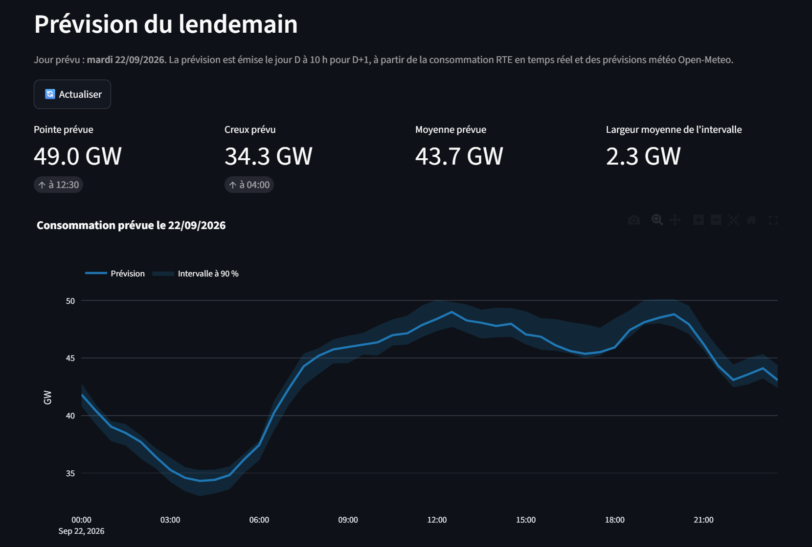
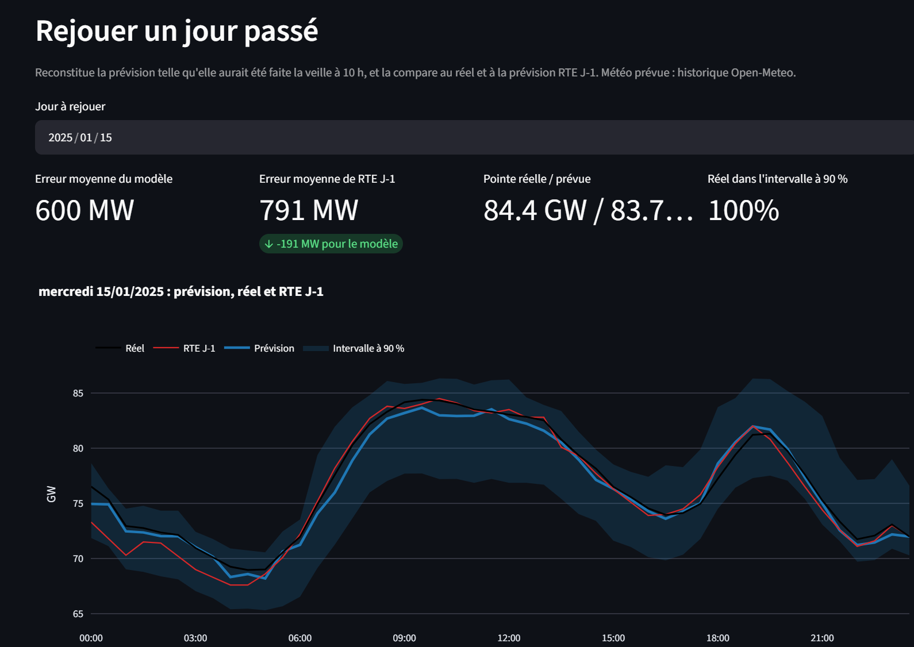
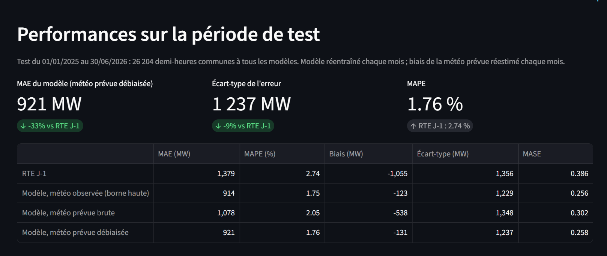

# Prévision de la consommation électrique française

Prévoir, le jour D à 10 h, la consommation nationale d'électricité des 48 demi-heures du jour D+1, avec un intervalle de prévision à 90 %, et la comparer à la prévision publiée par RTE.

Projet de data science en Python autour des séries temporelles, construit comme une étude complète puis industrialisé : exploration des données, protocole d'évaluation sans fuite de données (testé), baselines, modèle LightGBM, prise en compte de la **météo prévue** (et non observée), intervalles calibrés, package testé, API, tableau de bord et Docker.

## Résultats

Période de test : **janvier 2025 → juin 2026** (26 204 demi-heures communes à tous les modèles, données consolidées). Modèle **réentraîné chaque mois**, biais de la météo prévue **réestimé chaque mois** sur les 24 mois précédents, émission à 10 h le jour D (notebook 04, code de production).

| Modèle | MAE (MW) | MAPE | Biais (MW) | Écart-type de l'erreur (MW) |
|---|---|---|---|---|
| Naïf saisonnier (J-7) | 3 666 | 6,83 % | +154 | – |
| Régression linéaire par créneau (météo observée) | 1 505 | 3,00 % | −8 | – |
| **RTE J-1** (référence externe) | **1 379** | **2,74 %** | −1 055 | 1 356 |
| LightGBM de production, météo observée (borne haute) | 914 | 1,75 % | −123 | 1 229 |
| LightGBM de production, météo prévue brute | 1 078 | 2,05 % | −538 | 1 348 |
| **LightGBM de production, météo prévue, température débiaisée** | **921** | **1,76 %** | −131 | **1 237** |


**Comment lire ces chiffres**

- Avec la météo prévue débiaisée, la MAE est **33 % sous celle de RTE J-1**, et l'écart-type de l'erreur **9 % plus bas** (1 237 contre 1 356 MW). Cette seconde mesure ne dépend pas du biais de RTE.
- RTE a un **biais systématique de −1 GW**, dont la cause est inconnue (définition de la série ou dérive de la prévision). Il explique une part importante de l'avantage en MAE.
- **L'avantage est concentré hors de l'hiver.** Sous 0 °C, le modèle est à parité avec RTE, et n'est pas meilleur même avec une météo parfaite : la limite vient du modèle, pas de la météo.

| Température nationale | RTE J-1 (MW) | Production, débiaisée (MW) | Écart |
|---|---|---|---|
| < 0 °C | 1 505 | 1 521 | +1 % |
| 0-5 °C | 1 477 | 1 408 | −5 % |
| 5-10 °C | 1 200 | 1 094 | −9 % |
| 10-15 °C | 1 377 | 889 | −35 % |
| 15-20 °C | 1 427 | 656 | −54 % |
| 20-25 °C | 1 475 | 651 | −56 % |
| > 25 °C | 1 535 | 812 | −47 % |

- **Sans la consommation de la matinée de D** (émission à la fin de D−1), la MAE en météo prévue passe de 1 064 à 1 147 MW (notebook 03) : le résultat tient, mais RTE reprend l'avantage sur les créneaux de 0 h à 9 h 30. Les résultats ci-dessus supposent une émission à 10 h avec cette information.
- Le notebook 03, avec 2 000 arbres à pas 0,05, atteint 870 MW en météo observée (contre 914 MW pour le modèle de production, plus rapide à entraîner).
- **Intervalle à 90 %** : couverture de **90,0 %** sur le test, largeur moyenne 4,2 GW. Elle varie de 82 % à 97 % selon le mois et l'intervalle est trop large par temps froid.


## Ce que l'étude a montré

1. **Le niveau de consommation a baissé d'environ 5 GW en dix ans** (efficacité, autoconsommation solaire, sobriété), tandis que la sensibilité au froid (~2 GW par °C) reste stable. Un modèle « calendrier + météo » seul est donc biaisé : on prédit l'**écart au niveau récent** plutôt que la consommation brute.

   

   

2. **La météo est le premier levier** : corriger un naïf J-7 de la température fait baisser la MAE de 43 %.
3. **La météo prévue est biaisée**, surtout la nuit et le soir (+1,1 à +1,3 °C aujourd'hui, +0,2 °C vers 10-12 h). Servi avec des prévisions brutes, un modèle entraîné sur la météo observée voit son erreur augmenter de 18 % ; **corriger le biais par heure, avec un modèle réentraîné et un biais réestimé chaque mois, récupère ~96 % de cet écart** (74 % avec un modèle et un biais figés avant le test, notebook 03). Le biais évolue dans le temps, ce qui justifie de le réestimer régulièrement.

   

4. **La prévision RTE J-1 s'est dégradée depuis 2023** (MAPE de ~1,5 % à ~2,7 %) alors que la série n'est pas devenue plus difficile (le naïf J-7 est stable) : la dégradation est propre à RTE et prend la forme d'un biais.

   

## Les notebooks

À exécuter dans l'ordre (les suivants lisent les fichiers produits par les précédents).

| Notebook | Contenu | Durée indicative |
|---|---|---|
| [`01_exploration_donnees`](notebooks/01_exploration_donnees.ipynb) | Téléchargement (RTE éCO2mix, Open-Meteo, calendrier), contrôle qualité, saisonnalités, ruptures de régime, thermosensibilité, effet du type de jour, assemblage du jeu de données au pas de 30 min | 10 à 20 min (téléchargements au premier lancement) |
| [`02_baselines`](notebooks/02_baselines.ipynb) | Protocole d'évaluation, test de non-fuite, baselines, diagnostic de la prévision RTE | 5 à 10 min |
| [`03_lightgbm`](notebooks/03_lightgbm.ipynb) | Variables, météo prévue, ablation, backtest en trois modes de météo, SHAP, robustesse (sans informations de D, température débiaisée), intervalles quantiles et calibration conforme | environ 1 h |
| [`04_validation_production`](notebooks/04_validation_production.ipynb) | Validation du code de production (`src/conso`) : backtest mensuel avec biais réestimé chaque mois, intervalle de production, entraînement et sauvegarde du modèle final | 15 à 40 min |

## Méthode en bref

- **Protocole.** Émission le jour D à 10 h pour les 48 pas de D+1 ; réentraînement mensuel en *rolling origin* avec 2 jours d'écart ; tous les modèles évalués sur exactement les mêmes horodatages ; MAE, RMSE, MAPE, biais, MASE (référence : naïf J-7) et erreur sur la pointe journalière.
- **Sans fuite de données.** Un test efface la consommation postérieure à l'émission, reconstruit toutes les variables et vérifie que celles du jour cible ne changent pas (`tests/test_features.py`).
- **Cible.** Écart entre la consommation et `level7`, la moyenne des 7 jours complets T−8 … T−2.
- **Variables (39).** Calendrier (heure, jour, férié, pont, vacances par zone), météo à l'instant t et lissée, retards T−1 (créneaux avant 10 h), T−2, T−7, T−14, écart matinal de D.
- **Météo.** 10 agglomérations pondérées par la population ; observée (ERA5) à l'entraînement, prévue en exploitation, avec correction du biais horaire de la température.
- **Intervalles.** Régression quantile (5 % et 95 %) puis calibration conforme (CQR) stratifiée par température (froid, doux, chaud, très chaud).

## Le package `conso` et l'API

Le code de production est dans `src/conso/` : les mêmes fonctions servent au backtest (notebook 04), à l'entraînement (`python -m conso.train`) et à l'API. La fonction qui calcule les variables d'un seul jour sur une fenêtre de 45 jours est testée pour être identique au calcul sur tout l'historique, y compris les jours de changement d'heure.

| Route | Rôle |
|---|---|
| `GET /health` | état du service |
| `GET /model` | version, période d'entraînement, biais horaire, élargissements de l'intervalle |
| `GET /replay/range` | premier et dernier jour que le mode `replay` peut rejouer |
| `GET /forecast?date=2025-01-15&mode=replay` | rejoue la prévision d'un jour passé (hors ligne), avec le réel et la prévision RTE J-1 pour comparer |
| `GET /forecast?date=<demain>&mode=live` | prévision du lendemain à partir des données RTE et Open-Meteo en direct (nécessite Internet) |

Exemple de réponse (valeurs illustratives) :

```json
{
  "date": "2025-01-15", "mode": "replay", "issue_time": "2025-01-14T10:00:00+01:00",
  "model_version": "20260920-2213", "n_points": 48,
  "points": [{"time": "2025-01-15T00:00:00+01:00", "forecast_mw": 75300.0, "lower_mw": 71300.0,
              "upper_mw": 79800.0, "actual_mw": 76500.0, "rte_j1_mw": 73300.0}, "..."]
}
```

## Tableau de bord

Application Streamlit qui interroge l'API et présente les performances du modèle.

| Page | Contenu |
|---|---|
| **Demain (live)** | prévision du lendemain avec son intervalle à 90 % : pointe et creux prévus, moyenne, largeur de l'intervalle, courbe interactive, export CSV |
| **Rejouer un jour** | choix d'un jour passé : prévision reconstituée telle qu'elle aurait été faite la veille à 10 h, réel et prévision RTE J-1 sur le même graphique, erreur du jour du modèle et de RTE, réel dans l'intervalle ou non |
| **Performance** | tableau des métriques face à RTE J-1, erreur par mois, par température et par créneau, dégradation de RTE par année, avec les réserves de lecture |
| **Modèle** | version, période d'entraînement, biais horaire de la température prévue, élargissements de l'intervalle |






```powershell
docker compose up --build            # API sur :8000, tableau de bord sur :8501
```

Le tableau de bord est testé sans navigateur avec le moteur de test de Streamlit, branché sur la vraie API (`tests/test_dashboard.py`).

## Journal des prévisions réelles

Chaque jour, une tâche planifiée enregistre la prévision du lendemain **avant** de connaître le résultat
(`.github/workflows/journal-record.yml`), puis une seconde la complète avec le réel et la prévision RTE J-1
une fois connus (`journal-reconcile.yml`). C'est la seule validation du projet qui ne peut pas être ajustée
après coup : contrairement à un backtest, la prévision est écrite avant que le réel n'existe.

- **Stockage :** `journal/forecasts_AAAA-MM.parquet`, un fichier par mois, versionné dans le dépôt.
- **Horaires :** enregistrement à 09:15 UTC (toujours ≥ 10 h heure de Paris, hiver comme été) ; rapprochement à 05:00 UTC.
- **Consultation :** page « Journal » du dashboard, ou en ligne de commande :
  ```powershell
  poetry run python -m conso.journal summary
  ```
- **Modèle :** ces tâches ont besoin de `models/prod`, versionné dans le dépôt (~10 Mo) pour cette raison — voir `.gitignore`.

Le journal est encore jeune : ses chiffres deviennent significatifs après plusieurs semaines de collecte. Il donne
la seule mesure du **coût réel** de la météo prévue, que le backtest (notebook 04) sous-estime en s'appuyant sur
un historique de prévisions à courte échéance.

## Reproduire

Prérequis : Python 3.12 ou plus, [Poetry](https://python-poetry.org/).

```powershell
poetry install --with dev,notebooks,dashboard
poetry run jupyter lab                # exécuter les notebooks 01 → 04 dans l'ordre

poetry run pytest -q                  # 47 tests
poetry run ruff check src tests

# Entraîner le modèle de production (le notebook 04 le fait aussi)
poetry run python -m conso.train --dataset data/processed/dataset_30min.parquet `
    --meteo-fc data/raw/meteo_forecast_openmeteo.parquet --out models/prod

# Lancer l'API : documentation interactive sur http://localhost:8000/docs
$env:CONSO_MODEL="models/prod"
$env:CONSO_DATASET="data/processed/dataset_30min.parquet"
$env:CONSO_METEO_FC="data/raw/meteo_forecast_openmeteo.parquet"
poetry run uvicorn conso.api.main:app --reload

# Lancer le tableau de bord (dans un second terminal) : http://localhost:8501
$env:CONSO_API_URL="http://localhost:8000"
poetry run streamlit run src/conso/dashboard/app.py
```

**Docker** (nécessite `models/prod`, produit par le notebook 04 ou `conso.train`) :

```powershell
docker build -t conso-api .
docker run --rm -p 8000:8000 conso-api                               # mode live
docker run --rm -p 8000:8000 -v ${PWD}/data:/app/data `
    -e CONSO_DATASET=/app/data/processed/dataset_30min.parquet `
    -e CONSO_METEO_FC=/app/data/raw/meteo_forecast_openmeteo.parquet conso-api   # + mode replay
```

Les données ne sont pas versionnées : voir [`data/README.md`](data/README.md). Avant de committer des notebooks exécutés, lancer `python tools/scrub_notebooks.py` (anonymise les chemins personnels des sorties ; `--check` pour vérifier seulement).

## Limites

- **Heure d'émission de RTE inconnue** : les comparaisons supposent une émission à 10 h avec la matinée de D connue.
- **Coût de la météo prévue sous-estimé** : les prévisions historiques d'Open-Meteo ont des échéances courtes ; une vraie prévision J-1 est un peu moins précise. Le biais horaire est estimé sur la même source qu'en exploitation et doit être réestimé régulièrement.
- **Le gain en MAE sur RTE tient en partie à son biais** de −1 GW, dont la cause n'est pas établie. En écart-type de l'erreur, l'avance est de 9 %.
- **Froid intense (< 0 °C)** : parité avec RTE, pas d'amélioration. **Intervalle** : bien calibré en moyenne (90,0 %), mais trop large par temps froid et sous-couvrant au-delà de 25 °C (~85 %).
- **Mode `live` de l'API non testé sur le réseau réel** : dans la suite de tests, les appels RTE et Open-Meteo sont simulés.
- **Calendrier scolaire** : l'entraînement utilise les données de l'Éducation nationale depuis octobre 2017 (`vacances-scolaires-france` avant), l'API utilise ce package pour tous les jours.

## Suite prévue

Suivi d'expériences (MLflow), réentraînement mensuel automatisé avec suivi de la couverture de l'intervalle, amélioration des intervalles (scores normalisés, recalibration glissante) et du froid intense, comparaison avec un modèle fondation (Chronos, TimesFM).

## Structure du dépôt

```
notebooks/          01 exploration · 02 baselines · 03 LightGBM · 04 validation de la production
src/conso/          package : variables, météo, modèle, backtest, entraînement, API
src/conso/dashboard/ tableau de bord Streamlit
tests/              47 tests (fuite de données, changements d'heure, calendrier, météo, modèle, API, dashboard)
reports/figures/    figures utilisées dans ce README
data/  models/      régénérés localement (non versionnés)
tools/              scrub_notebooks.py : nettoyage des notebooks avant commit
Dockerfile · Dockerfile.dashboard · docker-compose.yml · Makefile · .github/workflows/ci.yml
```

## Licence

Code sous licence MIT (voir [`LICENSE`](LICENSE)). Les données appartiennent à leurs producteurs respectifs.
