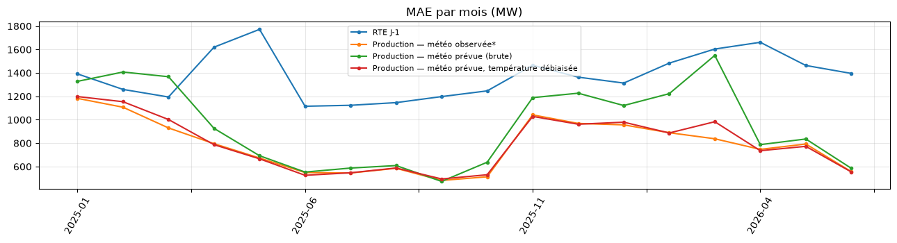
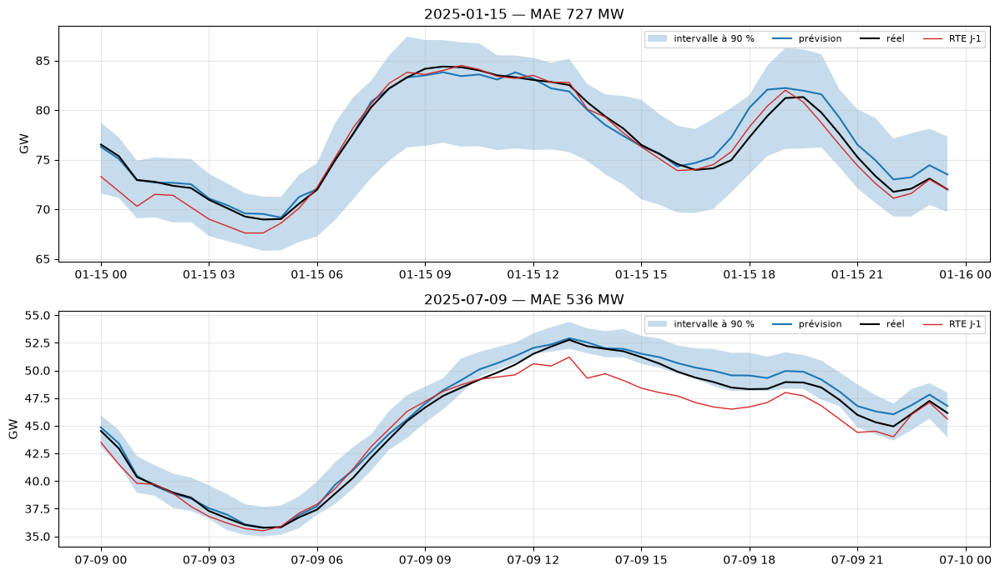
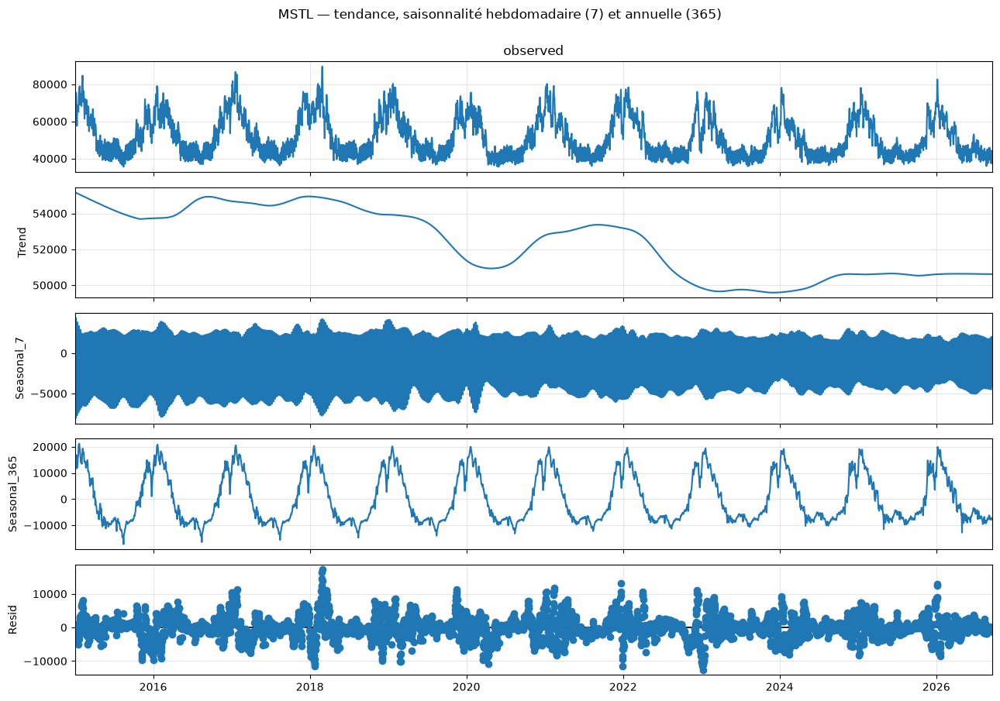
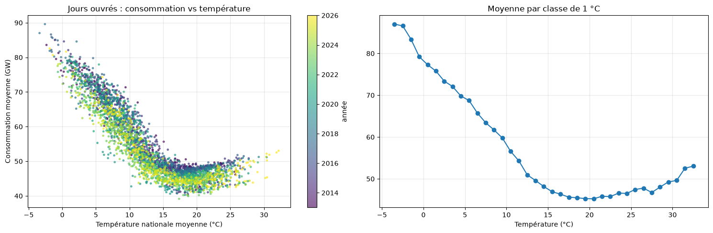
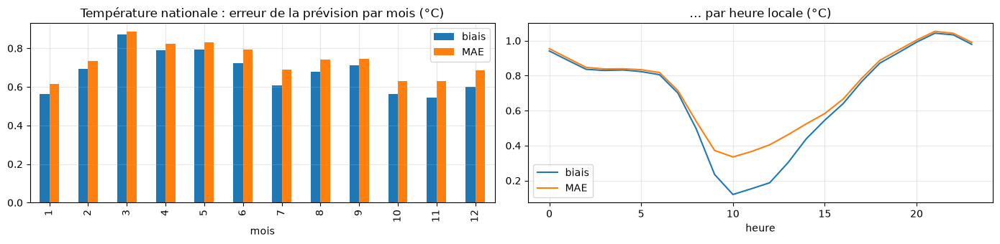
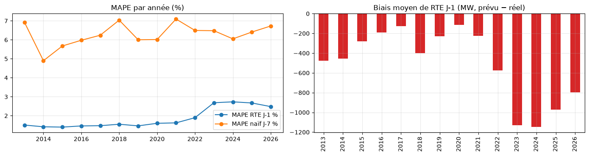
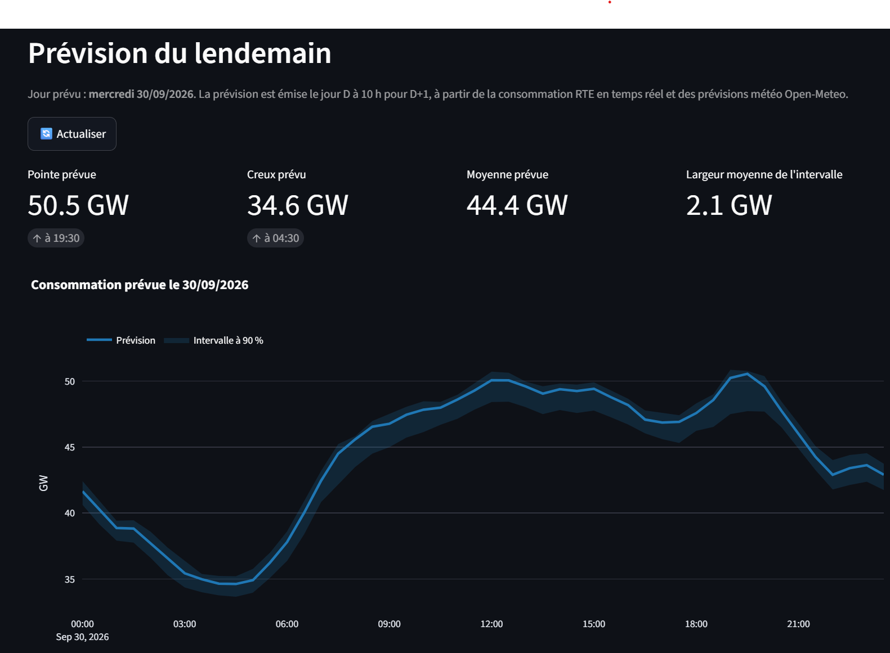
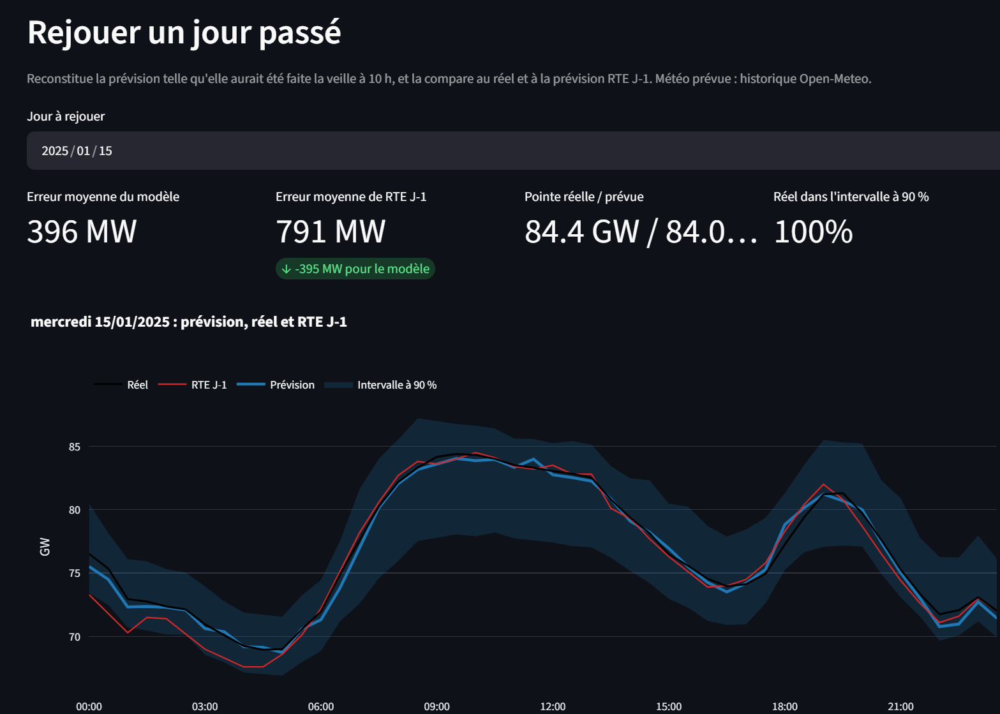
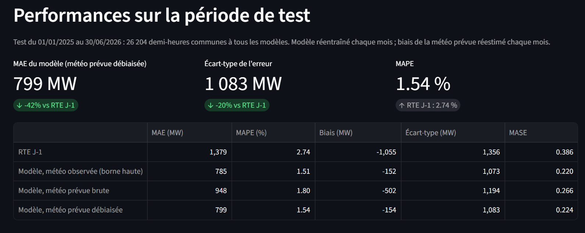
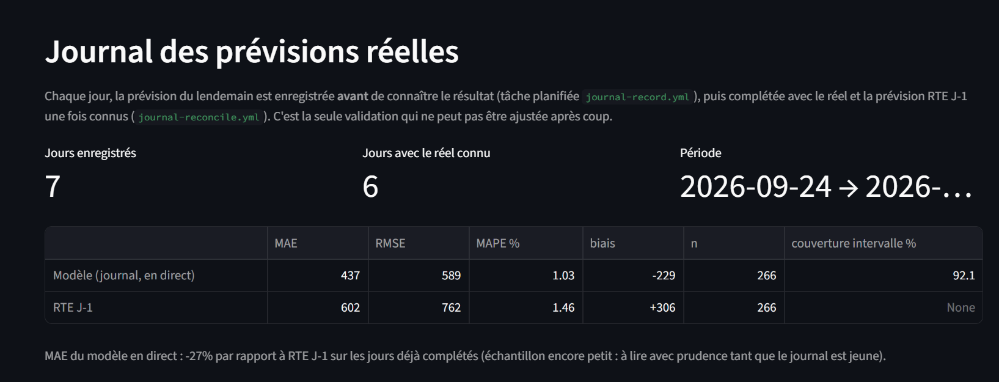

# Prévision de la consommation électrique française

Prévoir, le jour D à 10 h, la consommation nationale d'électricité des 48 demi-heures du jour D+1, avec un intervalle de prévision à 90 %, et la comparer à la prévision publiée par RTE.

Projet de data science en Python autour des séries temporelles, construit comme une étude complète puis industrialisé : exploration des données, protocole d'évaluation sans fuite de données (testé), baselines, modèle LightGBM, prise en compte de la **météo prévue** (et non observée), intervalles calibrés, package testé, API, tableau de bord et Docker.

## Résultats

Période de test : **janvier 2025 → juin 2026** (26 204 demi-heures communes à tous les modèles, données consolidées). Modèle **réentraîné chaque mois**, biais de la météo prévue **réestimé chaque mois** sur les 24 mois précédents, émission à 10 h le jour D (notebook 04, code de production).

| Modèle | MAE (MW) | MAPE | Biais (MW) | Écart-type de l'erreur (MW) |
|---|---|---|---|---|
| Naïf saisonnier (J-7) | 3 666 | 6,83 % | +154 | – |
| Régression linéaire par créneau (météo observée) | 1 505 | 3,00 % | −8 | – |
| **RTE J-1** (référence externe) | **1 379** | **2,74 %** | −1 055 | 1 356 |
| LightGBM de production, météo observée (borne haute) | 914 | 1,75 % | −123 | 1 229 |
| LightGBM de production, météo prévue brute | 1 078 | 2,05 % | −538 | 1 348 |
| **LightGBM de production, météo prévue, température débiaisée** | **921** | **1,76 %** | −131 | **1 237** |

Le tableau ci-dessus correspond au modèle à 39 variables et une graine (avant les notebooks 05 et 06), gardé comme repère historique. Voici le tableau à jour, notebook 04 rejoué avec le code de production actuel (55 variables, réentraînement mensuel, mélange `mel_nnls` du notebook 06 : LightGBM 3 graines, hybride lisse + LightGBM, CatBoost, un réseau de neurones et un modèle lisse, combinés par des poids appris) : test janvier 2025 à juin 2026, 26 204 points communs.

| Modèle | MAE (MW) | MAPE | Biais (MW) | Écart-type de l'erreur (MW) |
|---|---|---|---|---|
| RTE J-1 | 1 379 | 2,74 % | −1 055 | 1 356 |
| Production (mélange), météo observée* | 667 | 1,29 % | −149 | 888 |
| Production (mélange), météo prévue (brute) | 853 | 1,62 % | −530 | 1 015 |
| **Production (mélange), météo prévue, température débiaisée** | **684** | **1,32 %** | −163 | **912** |

\* météo observée (oracle) : borne haute.

**`point_model = "blend"` n'est pas le réglage par défaut** (voir « Méthode en bref ») : ce tableau correspond au mélange, actuellement déployé dans `models/prod`, mais un réentraînement lancé sans `--point-model blend` reviendrait à LightGBM seul (~921 MW, ligne du tableau précédent).



**Comment lire ces chiffres**

- Avec la météo prévue débiaisée, le mélange est à **50 % sous la MAE de RTE J-1** (33 % pour LightGBM seul), et son écart-type d'erreur est **33 % plus bas** (912 contre 1 356 MW). Cette seconde mesure ne dépend pas du biais de RTE.
- RTE a un **biais systématique de −1 GW**, dont la cause est inconnue (définition de la série ou dérive de la prévision). Il explique une part importante de l'avantage en MAE — d'où l'intérêt de regarder aussi l'écart-type.
- **Le froid intense n'est plus un angle mort.** Avec LightGBM seul, le modèle n'était qu'à parité avec RTE sous 0 °C. Le mélange y gagne 28 %, le gain le plus net de tous les régimes de température — cohérent avec le test d'extrapolation du notebook 06, qui montrait qu'un réseau de neurones généralise mieux qu'un arbre à un froid jamais vu à l'entraînement.

| Température nationale | RTE J-1 (MW) | Production (mélange), débiaisée (MW) | Écart |
|---|---|---|---|
| < 0 °C | 1 505 | 1 077 | **−28 %** |
| 0-5 °C | 1 477 | 983 | −33 % |
| 5-10 °C | 1 200 | 750 | −38 % |
| 10-15 °C | 1 377 | 640 | −54 % |
| 15-20 °C | 1 427 | 542 | −62 % |
| 20-25 °C | 1 475 | 546 | −63 % |
| > 25 °C | 1 535 | 731 | −52 % |

- **Sans la consommation de la matinée de D** (émission à la fin de D−1), la MAE en météo prévue passe de 1 064 à 1 147 MW (notebook 03) : le résultat tient, mais RTE reprend l'avantage sur les créneaux de 0 h à 9 h 30. Les résultats ci-dessus supposent une émission à 10 h avec cette information.
- Le notebook 03, avec 2 000 arbres à pas 0,05, atteint 870 MW en météo observée (contre 914 MW pour LightGBM de production, plus rapide à entraîner).
- **Intervalle à 90 %** : couverture de **91,4 %** sur le test (cible 90 %). Elle varie par régime de température : froid 97,2 % (trop large), doux 92,9 %, chaud 87,1 %, très chaud 88,7 % (légèrement sous-couvrant). Ce déséquilibre n'est pas résolu par le changement de modèle ponctuel : les modèles quantiles restent du LightGBM à une seule graine, que `point_model` soit `"lgbm"` ou `"blend"`.



## Ce que l'étude a montré

1. **Le niveau de consommation a baissé d'environ 5 GW en dix ans** (efficacité, autoconsommation solaire, sobriété), tandis que la sensibilité au froid (~2 GW par °C) reste stable. Un modèle « calendrier + météo » seul est donc biaisé : on prédit l'**écart au niveau récent** plutôt que la consommation brute.

   

   

2. **La météo est le premier levier** : corriger un naïf J-7 de la température fait baisser la MAE de 43 %.
3. **La météo prévue est biaisée**, surtout la nuit et le soir (+1,1 à +1,3 °C aujourd'hui, +0,2 °C vers 10-12 h). Servi avec des prévisions brutes, un modèle entraîné sur la météo observée voit son erreur augmenter de 18 % ; **corriger le biais par heure, avec un modèle réentraîné et un biais réestimé chaque mois, récupère ~96 % de cet écart** (74 % avec un modèle et un biais figés avant le test, notebook 03). Le biais évolue dans le temps, ce qui justifie de le réestimer régulièrement.

   

4. **La prévision RTE J-1 s'est dégradée depuis 2023** (MAPE de ~1,5 % à ~2,7 %) alors que la série n'est pas devenue plus difficile (le naïf J-7 est stable) : la dégradation est propre à RTE et prend la forme d'un biais.

   

## Les notebooks

À exécuter dans l'ordre (les suivants lisent les fichiers produits par les précédents).

| Notebook | Contenu | Durée indicative |
|---|---|---|
| [`01_exploration_donnees`](notebooks/01_exploration_donnees.ipynb) | Téléchargement (RTE éCO2mix, Open-Meteo, calendrier), contrôle qualité, saisonnalités, ruptures de régime, thermosensibilité, effet du type de jour, assemblage du jeu de données au pas de 30 min | 10 à 20 min (téléchargements au premier lancement) |
| [`02_baselines`](notebooks/02_baselines.ipynb) | Protocole d'évaluation, test de non-fuite, baselines, diagnostic de la prévision RTE | 5 à 10 min |
| [`03_lightgbm`](notebooks/03_lightgbm.ipynb) | Variables, météo prévue, ablation, backtest en trois modes de météo, SHAP, robustesse (sans informations de D, température débiaisée), intervalles quantiles et calibration conforme | environ 1 h |
| [`04_validation_production`](notebooks/04_validation_production.ipynb) | Validation du code de production (`src/conso`) : backtest mensuel avec biais réestimé chaque mois, intervalle de production, entraînement et sauvegarde du modèle final ; `POINT_MODEL` choisit entre LightGBM seul et le mélange | 15 à 40 min (LightGBM), plusieurs heures (mélange) |
| [`05_experiment_features_froid_spatial`](notebooks/05_experiment_features_froid_spatial.ipynb) | Laboratoire de variables : 9 familles testées avec bruit de graine, bootstrap par blocs, ablation inversée, test d'extrapolation au froid et confirmation aveugle sur 2025+ | 1 à plusieurs heures selon le profil |
| [`06_experiment_modeles`](notebooks/06_experiment_modeles.ipynb) | Autres modèles (lisse, hybride, CatBoost, réseau de neurones) et mélanges, même protocole que le notebook 05 | 1 à plusieurs heures selon le profil |

## Méthode en bref

- **Protocole.** Émission le jour D à 10 h pour les 48 pas de D+1 ; réentraînement mensuel en *rolling origin* avec 2 jours d'écart ; tous les modèles évalués sur exactement les mêmes horodatages ; MAE, RMSE, MAPE, biais, MASE (référence : naïf J-7) et erreur sur la pointe journalière.
- **Sans fuite de données.** Un test efface la consommation postérieure à l'émission, reconstruit toutes les variables et vérifie que celles du jour cible ne changent pas (`tests/test_features.py`).
- **Cible.** Écart entre la consommation et `level7`, la moyenne des 7 jours complets T−8 … T−2.
- **Variables (55).** Calendrier (heure, jour, férié, pont, vacances par zone), météo à l'instant t et lissée, retards T−1 (créneaux avant 10 h), T−2, T−7, T−14, écart matinal de D ; depuis le notebook 05 : dynamique thermique (moyennes exponentielles multi-échelles, variations sur 24 et 48 h, séries de jours froids) et informations de la matinée de D (dernier point connu, pente, écart des 3 dernières heures, écart de température).
- **Modèle ponctuel.** Moyenne de 3 modèles LightGBM entraînés avec des graines différentes (`DEFAULT_SEEDS`) : la variance d'un modèle isolé est loin d'être négligeable. Un mélange à poids appris (`conso.models_alt`, `train_bundle(..., point_model="blend")`) est aussi disponible depuis le notebook 06 : LightGBM, un hybride lisse + LightGBM, CatBoost, un réseau de neurones et un modèle lisse, combinés par des poids appris par moindres carrés positifs. Il gagne environ 15 % de MAE sur la confirmation 2025+, mais coûte environ 10× plus cher à entraîner (le réseau de neurones domine ce coût) : **ce n'est pas le modèle par défaut** (`point_model="lgbm"`), à activer explicitement selon les contraintes d'infrastructure. Nécessite `pip install conso-electrique-fr[models-alt]` (scikit-learn, catboost, torch).
- **Météo.** 10 agglomérations pondérées par la population ; observée (ERA5) à l'entraînement, prévue en exploitation, avec correction du biais horaire de la température.
- **Intervalles.** Régression quantile (5 % et 95 %) puis calibration conforme (CQR) stratifiée par température (froid, doux, chaud, très chaud). Indépendante de `point_model` : toujours du LightGBM à une seule graine.

## Le package `conso` et l'API

Le code de production est dans `src/conso/` : les mêmes fonctions servent au backtest (notebook 04), à l'entraînement (`python -m conso.train`) et à l'API. La fonction qui calcule les variables d'un seul jour sur une fenêtre de 45 jours est testée pour être identique au calcul sur tout l'historique, y compris les jours de changement d'heure.

| Route | Rôle |
|---|---|
| `GET /health` | état du service |
| `GET /model` | version, période d'entraînement, modèle ponctuel (LightGBM ou mélange), biais horaire, élargissements de l'intervalle |
| `GET /replay/range` | premier et dernier jour que le mode `replay` peut rejouer |
| `GET /forecast?date=2025-01-15&mode=replay` | rejoue la prévision d'un jour passé (hors ligne), avec le réel et la prévision RTE J-1 pour comparer |
| `GET /forecast?date=<demain>&mode=live` | prévision du lendemain à partir des données RTE et Open-Meteo en direct (nécessite Internet) |

Exemple de réponse (valeurs illustratives) :

```json
{
  "date": "2025-01-15", "mode": "replay", "issue_time": "2025-01-14T10:00:00+01:00",
  "model_version": "20260920-2213", "n_points": 48,
  "points": [{"time": "2025-01-15T00:00:00+01:00", "forecast_mw": 75300.0, "lower_mw": 71300.0,
              "upper_mw": 79800.0, "actual_mw": 76500.0, "rte_j1_mw": 73300.0}, "..."]
}
```

## Tableau de bord

Application Streamlit qui interroge l'API et présente les performances du modèle.

| Page | Contenu |
|---|---|
| **Demain (live)** | prévision du lendemain avec son intervalle à 90 % : pointe et creux prévus, moyenne, largeur de l'intervalle, courbe interactive, export CSV |
| **Rejouer un jour** | choix d'un jour passé : prévision reconstituée telle qu'elle aurait été faite la veille à 10 h, réel et prévision RTE J-1 sur le même graphique, erreur du jour du modèle et de RTE, réel dans l'intervalle ou non |
| **Performance** | tableau des métriques face à RTE J-1, erreur par mois, par température et par créneau, dégradation de RTE par année, avec les réserves de lecture |
| **Journal** | comparatif de l'erreur du modèle et de RTE avec les prévisions réelles |
| **Modèle** | version, période d'entraînement, modèle ponctuel (LightGBM ou composition du mélange), biais horaire de la température prévue, élargissements de l'intervalle |







```powershell
docker compose up --build            # API sur :8000, tableau de bord sur :8501
```

Si `models/prod` est un mélange (`point_model="blend"`), reconstruire l'image `api` avec `docker compose build --build-arg MODEL_GROUPS=main,models-alt api` avant `docker compose up -d` (voir `docker-compose.yml` et `Dockerfile`) : sans ce paramètre, l'API échoue au chargement du modèle.

Le tableau de bord est testé sans navigateur avec le moteur de test de Streamlit, branché sur la vraie API (`tests/test_dashboard.py`).

## Journal des prévisions réelles

Chaque jour, une tâche planifiée enregistre la prévision du lendemain **avant** de connaître le résultat
(`.github/workflows/journal-record.yml`), puis une seconde la complète avec le réel et la prévision RTE J-1
une fois connus (`journal-reconcile.yml`). C'est la seule validation du projet qui ne peut pas être ajustée
après coup : contrairement à un backtest, la prévision est écrite avant que le réel n'existe.

- **Stockage :** `journal/forecasts_AAAA-MM.parquet`, un fichier par mois, versionné dans le dépôt.
- **Horaires :** enregistrement à 09:15 UTC (toujours ≥ 10 h heure de Paris, hiver comme été) ; rapprochement à 05:00 UTC.
- **Consultation :** page « Journal » du dashboard, ou en ligne de commande :
  ```powershell
  poetry run python -m conso.journal summary
  ```
- **Modèle :** ces tâches ont besoin de `models/prod`, versionné dans le dépôt (~10 Mo pour LightGBM seul ; plus si `point_model="blend"`, voir `.gitignore`).

Le journal est encore jeune : ses chiffres deviennent significatifs après plusieurs semaines de collecte. Il donne
la seule mesure du **coût réel** de la météo prévue, que le backtest (notebook 04) sous-estime en s'appuyant sur
un historique de prévisions à courte échéance.

## Reproduire

Prérequis : Python 3.12 ou plus, [Poetry](https://python-poetry.org/).

```powershell
poetry install --with dev,notebooks,dashboard
# ajouter models-alt pour entraîner ou tester le mélange (point_model="blend", notebooks 04/06) :
#   poetry install --with dev,notebooks,dashboard,models-alt
poetry run jupyter lab                # exécuter les notebooks 01 → 04 dans l'ordre

poetry run pytest -q                  # 79 tests
poetry run ruff check src tests

# Entraîner le modèle de production (le notebook 04 le fait aussi)
poetry run python -m conso.train --dataset data/processed/dataset_30min.parquet `
    --meteo-fc data/raw/meteo_forecast_openmeteo.parquet --out models/prod
    # ajouter --point-model blend pour le mélange (nécessite le groupe models-alt, ~10x plus lent)

# Lancer l'API : documentation interactive sur http://localhost:8000/docs
$env:CONSO_MODEL="models/prod"
$env:CONSO_DATASET="data/processed/dataset_30min.parquet"
$env:CONSO_METEO_FC="data/raw/meteo_forecast_openmeteo.parquet"
poetry run uvicorn conso.api.main:app --reload

# Lancer le tableau de bord (dans un second terminal) : http://localhost:8501
$env:CONSO_API_URL="http://localhost:8000"
poetry run streamlit run src/conso/dashboard/app.py
```

**Docker** (nécessite `models/prod`, produit par le notebook 04 ou `conso.train`) :

```powershell
docker build -t conso-api .
docker run --rm -p 8000:8000 conso-api                               # mode live
docker run --rm -p 8000:8000 -v ${PWD}/data:/app/data `
    -e CONSO_DATASET=/app/data/processed/dataset_30min.parquet `
    -e CONSO_METEO_FC=/app/data/raw/meteo_forecast_openmeteo.parquet conso-api   # + mode replay
```

Si `models/prod` est un mélange, ajouter `--build-arg MODEL_GROUPS=main,models-alt` à la commande `docker build` ci-dessus.

Les données ne sont pas versionnées. Avant de committer des notebooks exécutés, lancer `python tools/scrub_notebooks.py` (anonymise les chemins personnels des sorties ; `--check` pour vérifier seulement).

## Limites

- **Heure d'émission de RTE inconnue** : les comparaisons supposent une émission à 10 h avec la matinée de D connue.
- **Coût de la météo prévue sous-estimé** : les prévisions historiques d'Open-Meteo ont des échéances courtes ; une vraie prévision J-1 est un peu moins précise. Le biais horaire est estimé sur la même source qu'en exploitation et doit être réestimé régulièrement.
- **Le gain en MAE sur RTE tient en partie à son biais** de −1 GW, dont la cause n'est pas établie. En écart-type de l'erreur, l'avance est de 33 % avec le mélange (9 % avec LightGBM seul).
- **Froid intense (< 0 °C)** : LightGBM seul n'est qu'à parité avec RTE ; le mélange y gagne 28 %, mais au prix d'un entraînement ~10× plus coûteux, et ce n'est pas le modèle par défaut.
- **Intervalle** : bien calibré en moyenne (91,4 %, cible 90 %), mais trop large par temps froid (97,2 %) et légèrement sous-couvrant par temps chaud (87,1 à 88,7 %) ; indépendant du choix de modèle ponctuel, les modèles quantiles restant du LightGBM à une seule graine dans tous les cas.
- **Mode `live` de l'API non testé sur le réseau réel** : dans la suite de tests, les appels RTE et Open-Meteo sont simulés.
- **Calendrier scolaire** : l'entraînement utilise les données de l'Éducation nationale depuis octobre 2017 (`vacances-scolaires-france` avant), l'API utilise ce package pour tous les jours.

## Suite prévue

Suivi d'expériences (MLflow), réentraînement mensuel automatisé avec suivi de la couverture de l'intervalle, amélioration des intervalles (scores normalisés, recalibration glissante) et refresh périodique des poids du mélange / du nombre d'époques du réseau de neurones (notebook 06), comparaison avec un modèle fondation (Chronos, TimesFM).

## Structure du dépôt

```
notebooks/          01 exploration · 02 baselines · 03 LightGBM · 04 validation de la production · 05 variables · 06 modèles
src/conso/          package : variables, météo, modèle, modèles alternatifs et mélange, backtest, entraînement
src/conso/api       API
src/conso/dashboard/ tableau de bord Streamlit
tests/              79 tests (fuite de données, changements d'heure, calendrier, météo, modèle, mélange, API, dashboard)
reports/figures/    figures utilisées dans ce README
data/  models/      régénérés localement (non versionnés, sauf models/prod)
tools/              scrub_notebooks.py : nettoyage des notebooks avant commit
Dockerfile · Dockerfile.dashboard · docker-compose.yml · Makefile · .github/workflows/ci.yml
```

## Licence

Code sous licence MIT (voir [`LICENSE`](LICENSE)). Les données appartiennent à leurs producteurs respectifs.
